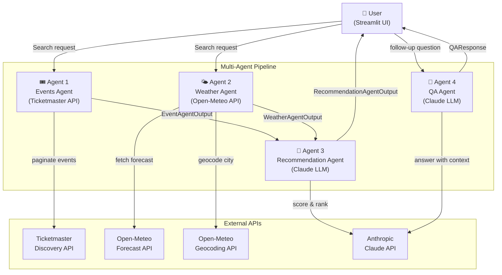
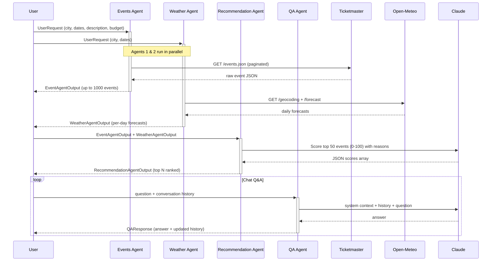
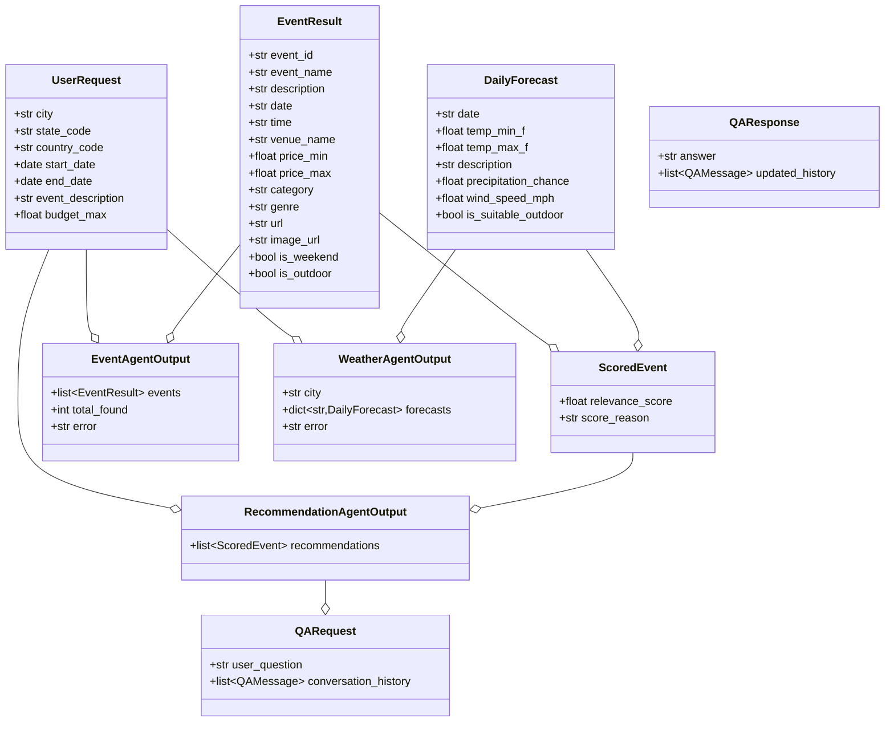

# EventScout 🎭

> AI-powered event discovery — find the best events in your city, scored by Claude and matched with live weather forecasts.

Built with a **multi-agent architecture**: four specialised agents collaborate to fetch events, check the weather, rank recommendations with an LLM, and answer follow-up questions in a chat interface.

---

## Demo


---

## Architecture

### High-Level System



---

### Agent Pipeline (Sequential + Parallel)



---

### Data Model



---

## Project Structure

```
event-recommendor/
├── app.py                      # Streamlit UI
├── config.py                   # API keys, model name, constants
├── pyproject.toml              # Python deps (uv)
├── agents/
│   ├── events_agent.py         # Agent 1 — Ticketmaster event fetcher
│   ├── weather_agent.py        # Agent 2 — Open-Meteo weather fetcher
│   ├── recommendation_agent.py # Agent 3 — Claude LLM scorer & ranker
│   └── qa_agent.py             # Agent 4 — Claude LLM chat assistant
└── models/
    └── schemas.py              # Pydantic models shared across all agents
```

---

## Quickstart

### Prerequisites

| Requirement | Notes |
|---|---|
| Python 3.11+ | |
| [uv](https://docs.astral.sh/uv/) | Fast Python package manager |
| Anthropic API key | [console.anthropic.com](https://console.anthropic.com) |
| Ticketmaster API key | [developer.ticketmaster.com](https://developer.ticketmaster.com) — free tier available |

### Run

```bash
# 1. Clone
git clone https://github.com/ritwiksharan/event-recommendor.git
cd event-recommendor

# 2. Install dependencies
uv sync

# 3. Run
ANTHROPIC_API_KEY="sk-ant-..." uv run streamlit run app.py
```

Open **http://localhost:8501** in your browser.

### Optional env vars

```bash
export ANTHROPIC_API_KEY="sk-ant-..."
export TICKETMASTER_API_KEY="your-key"  # defaults to a demo key in config.py
```

---

## How It Works

### Agent 1 — Events Agent
Queries the **Ticketmaster Discovery API** with the user's city, date range, and optional budget filter. Paginates up to 1,000 results, parses venue/price/category data, and flags each event as `is_weekend` or `is_outdoor`.

### Agent 2 — Weather Agent
Geocodes the city via **Open-Meteo's geocoding API**, then fetches a daily forecast (temperature, precipitation chance, wind speed, WMO weather code) for each day in the date range. Marks each day `is_suitable_outdoor` based on weather codes + precipitation + wind.

### Agent 3 — Recommendation Agent
Sends the top 50 events (with their weather context) to **Claude** with a structured prompt. Claude returns a JSON array of scores (0–100) and one-sentence reasons, prioritising semantic match → budget fit → timing. Results are sorted and the top N are returned.

### Agent 4 — QA Agent
A stateless chat agent that receives the full recommendation context + conversation history on every call. Powered by **Claude**, it answers questions about specific events, prices, venues, weather, or ticket links.

---

## Tech Stack

| Layer | Technology |
|---|---|
| UI | [Streamlit](https://streamlit.io) |
| LLM | [Claude](https://anthropic.com) via [LiteLLM](https://github.com/BerriAI/litellm) |
| Events data | [Ticketmaster Discovery API](https://developer.ticketmaster.com/products-and-docs/apis/discovery-api/v2/) |
| Weather data | [Open-Meteo](https://open-meteo.com) (no API key required) |
| Data validation | [Pydantic v2](https://docs.pydantic.dev) |
| Package management | [uv](https://docs.astral.sh/uv/) |

---

## License

MIT
