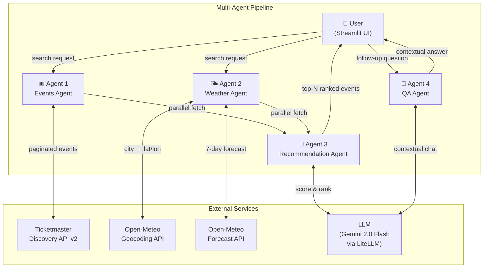
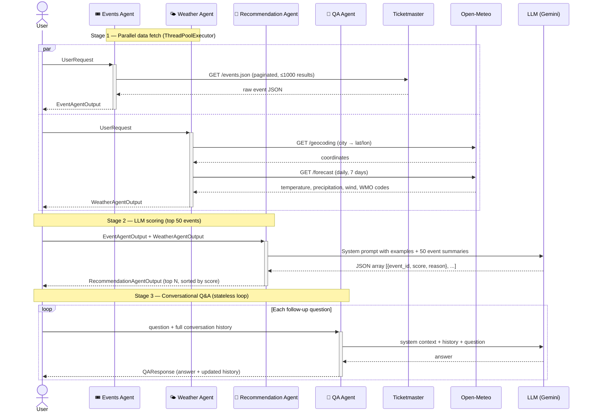
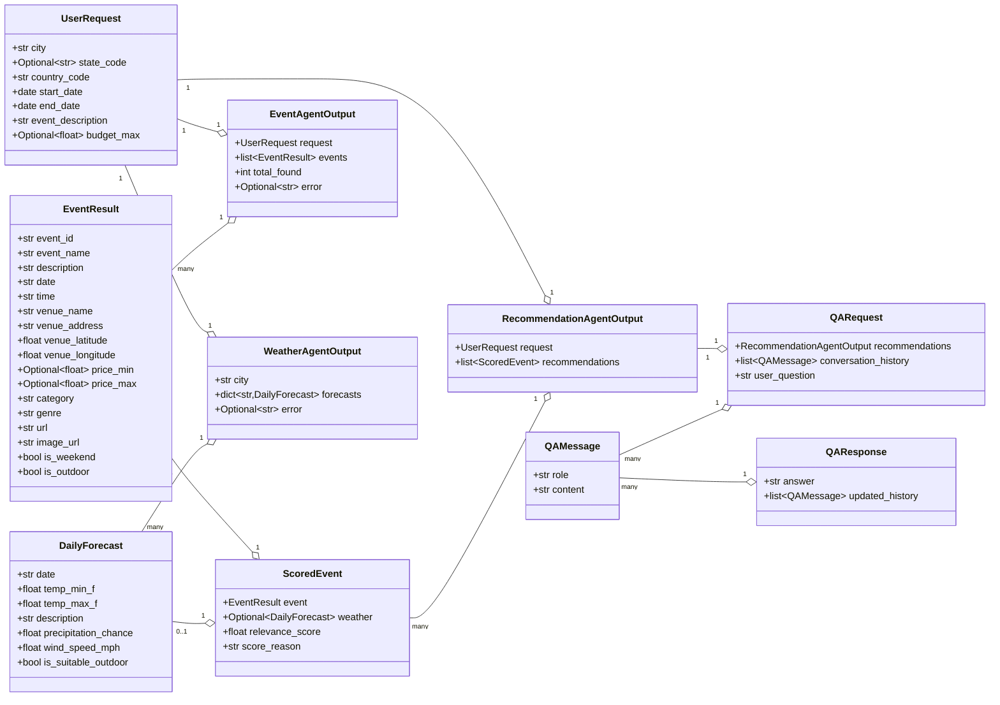
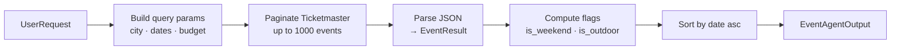
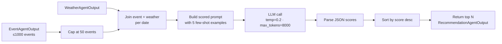
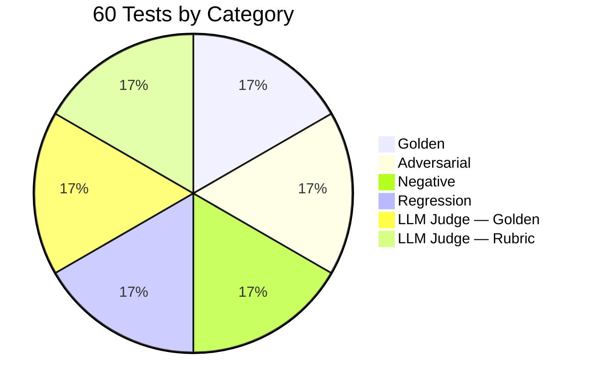

# EventScout 🎭

> AI-powered event discovery — find the best events in your city, scored by an LLM and matched with live weather forecasts.

EventScout uses a **4-agent pipeline** to fetch events from Ticketmaster, pull live weather forecasts, rank everything with a language model, and answer follow-up questions in a conversational chat interface.

---

## Table of Contents

- [Architecture](#architecture)
  - [System Overview](#system-overview)
  - [Request & Data Flow](#request--data-flow)
  - [Data Model](#data-model)
- [Project Structure](#project-structure)
- [Agents](#agents)
  - [Agent 1 — Events](#agent-1--events-agent)
  - [Agent 2 — Weather](#agent-2--weather-agent)
  - [Agent 3 — Recommendation](#agent-3--recommendation-agent)
  - [Agent 4 — QA](#agent-4--qa-agent)
- [Evaluation Suite](#evaluation-suite)
- [Quickstart](#quickstart)
- [Configuration](#configuration)
- [Tech Stack](#tech-stack)

---

## Architecture

### System Overview



---

### Request & Data Flow



---

### Data Model



---

## Project Structure

```
event-recommendor/
│
├── app.py                       # Streamlit UI — search form, results cards, chat
├── config.py                    # API keys, LLM model string, weather constants
├── eval.py                      # 60-test evaluation suite
├── pyproject.toml               # Python project metadata + deps (uv)
│
├── agents/
│   ├── events_agent.py          # Agent 1 — Ticketmaster fetcher & parser
│   ├── weather_agent.py         # Agent 2 — Open-Meteo geocoding + forecast
│   ├── recommendation_agent.py  # Agent 3 — LLM scoring & ranking
│   └── qa_agent.py              # Agent 4 — stateless LLM chat assistant
│
└── models/
    └── schemas.py               # Pydantic v2 models shared by all agents
```

---

## Agents

### Agent 1 — Events Agent

**File:** `agents/events_agent.py`

Fetches and parses events from the **Ticketmaster Discovery API v2**.

- Paginates through results up to **1,000 events** per search
- Filters by city, state/country, date range, and optional budget cap
- Parses raw JSON into typed `EventResult` objects
- Computes two boolean flags on every event:
  - `is_weekend` — `True` if the event falls on Friday, Saturday, or Sunday
  - `is_outdoor` — `True` if the venue name contains keywords like `stadium`, `park`, `amphitheater`, `field`, `grounds`, or `pavilion`
- Returns results sorted by date ascending



---

### Agent 2 — Weather Agent

**File:** `agents/weather_agent.py`

Fetches a **daily weather forecast** for each day in the user's date range using Open-Meteo (free, no API key required).

- Geocodes the city name → `(lat, lon)` via Open-Meteo Geocoding API
- Fetches daily forecast: temperature (min/max), precipitation probability, wind speed, WMO weather code
- Converts units — Celsius → Fahrenheit, km/h → mph
- Marks each day `is_suitable_outdoor = True` only when **all three** conditions hold:
  - WMO code is not in the bad-weather set (rain, snow, fog, thunderstorm, etc.)
  - Precipitation chance < 50 %
  - Wind speed < 25 mph
- Returns a `dict[date_str → DailyForecast]` for O(1) lookup by the recommendation agent

---

### Agent 3 — Recommendation Agent

**File:** `agents/recommendation_agent.py`

The **LLM scoring brain** — ranks events by how well they match the user's request.

- Caps input at **50 events** to stay within token limits
- Joins each event with its weather forecast for that day
- Sends a structured prompt to the LLM asking for a score (0–100) and a one-sentence reason per event
- The system prompt uses **5 few-shot examples** to guide scoring:

| Example | User wants | Event | Score |
|---|---|---|---|
| Perfect match | Jazz, indoor, weekend | Birdland Jazz Night — Indoor, Friday | 92 |
| Wrong category | Jazz, indoor, weekend | Yankees vs Red Sox — Outdoor, Saturday | 8 |
| Partial match | Jazz, indoor, weekend | Classical Piano Recital — Indoor, Saturday | 45 |
| Budget mismatch | Live music, $30 max | Coldplay World Tour — $150–$300 | 20 |
| Weather penalty | Outdoor festival | Summer Music Festival — Heavy rain | 30 |

- Parses the returned JSON array, strips any markdown fences
- Falls back to score = 50 for any event the LLM didn't score (escape hatch)
- Sorts by score descending, returns the top N



---

### Agent 4 — QA Agent

**File:** `agents/qa_agent.py`

A **stateless conversational assistant** that answers follow-up questions about the recommendations.

- Builds a rich system context from all top recommendations (name, date, venue, price, weather, ticket URL, score reason)
- The system prompt includes **5 worked examples** to steer answer style:

| Scenario | Behaviour |
|---|---|
| Specific question ("What time does #1 start?") | Answers with full event details |
| Comparison ("Which is better value, #1 or #2?") | Compares price + score |
| Out-of-scope ("Capital of France?") | Politely redirects to event questions |
| Ticket request ("How do I buy tickets?") | Returns the actual URL from data |
| Emotional query ("I feel lonely tonight") | Shows empathy, suggests a relevant event |

- **Escape hatch:** if the data doesn't contain the answer, says so — never fabricates prices, times, or venue details
- **Stateless design:** full context + history sent on every call; the caller (UI) owns the history

---

## Evaluation Suite

**File:** `eval.py` — **60 automated tests** across 6 categories, run against the live pipeline end-to-end.



| Category | Count | What's tested |
|---|---|---|
| **Golden** | 10 | Expected correct outputs — jazz query returns music, budget is respected, scores are descending, weather data is attached |
| **Adversarial** | 10 | Edge cases — vague descriptions, $0 budget, outdoor request in a rainy city, non-English queries, nonsense input |
| **Negative** | 10 | Wrong matches must score low — sports events for a jazz query should be < 50, budget violations penalised |
| **Regression** | 10 | Data integrity — weather dict has correct days, `is_outdoor`/`is_weekend` flags, parallel execution, QA history grows |
| **MaaJ Golden** | 10 | LLM-judged QA answers graded 1–5 against a known correct answer (model-as-a-judge) |
| **MaaJ Rubric** | 10 | LLM-judged QA quality graded against a rubric — empathy, completeness, accuracy, helpfulness |

**Run:**

```bash
source .env && uv run python eval.py
```

Prints per-test pass/fail and a summary count per category.

---

## Quickstart

### Prerequisites

| Requirement | Notes |
|---|---|
| Python 3.11+ | Pinned via `.python-version` |
| [uv](https://docs.astral.sh/uv/) | `curl -LsSf https://astral.sh/uv/install.sh \| sh` |
| Anthropic API key | [console.anthropic.com](https://console.anthropic.com) |
| Ticketmaster API key | [developer.ticketmaster.com](https://developer.ticketmaster.com) — free tier available |

### Install & Run

```bash
# 1. Clone
git clone https://github.com/ritwiksharan/event-recommendor.git
cd event-recommendor

# 2. Install dependencies
uv sync

# 3. Set environment variables
export ANTHROPIC_API_KEY="sk-ant-..."
export TICKETMASTER_API_KEY="your-key"   # optional — a demo key is bundled in config.py

# 4. Start the app
uv run streamlit run app.py
# → http://localhost:8501
```

---

## Configuration

All constants live in `config.py`:

| Variable | Default | Purpose |
|---|---|---|
| `TICKETMASTER_API_KEY` | env var or bundled demo key | Ticketmaster Discovery API key |
| `CLAUDE_MODEL` | `vertex_ai/gemini-2.0-flash` | LiteLLM model string — swap for any provider |
| `OUTDOOR_KEYWORDS` | `stadium`, `park`, `amphitheater`, … | Venue name keywords used to set `is_outdoor` |
| `WMO_CODES` | 25-entry dict | Human-readable labels for WMO weather codes |
| `BAD_CODES` | 16-entry set | WMO codes treated as unsuitable for outdoor events |

**Switching models** — LiteLLM supports any provider by changing `CLAUDE_MODEL`:

```python
# Google Gemini via Vertex AI (current default)
CLAUDE_MODEL = "vertex_ai/gemini-2.0-flash"

# Anthropic Claude
CLAUDE_MODEL = "claude-haiku-4-5-20251001"

# OpenAI
CLAUDE_MODEL = "gpt-4o-mini"
```

---

## Tech Stack

| Layer | Technology |
|---|---|
| UI | [Streamlit](https://streamlit.io) |
| LLM gateway | [LiteLLM](https://github.com/BerriAI/litellm) — provider-agnostic |
| Default LLM | Gemini 2.0 Flash via Vertex AI |
| Events data | [Ticketmaster Discovery API v2](https://developer.ticketmaster.com/products-and-docs/apis/discovery-api/v2/) |
| Weather data | [Open-Meteo](https://open-meteo.com) — free, no key needed |
| Data validation | [Pydantic v2](https://docs.pydantic.dev) |
| Package manager | [uv](https://docs.astral.sh/uv/) |
| Python | 3.11 |

---

## License

MIT
